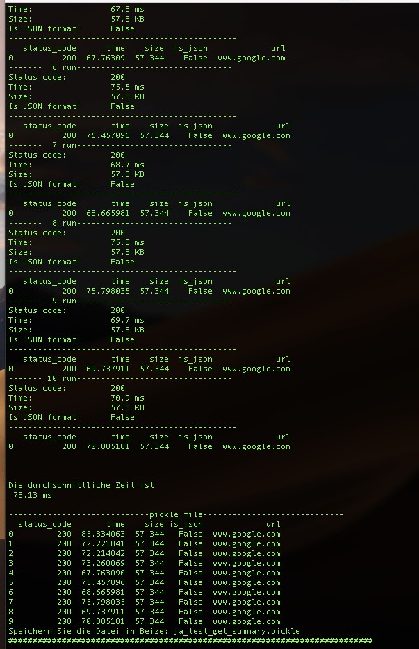

#  Program List
---

### test_get_api.py
---
- Summary: 
usrl:
https://www.google.com/
the file size of resp.text =  57.34 KB 
-----------------
Status code:         200
Time:                89.9 ms
Size:                57.3 KB
------------------

---

😈
### test_get_api_par_url_statuscode.py

---

---

🆕
### test_get_api_par_url_all_day_et_plot.py
use to see the specific web-site high-low time

### The Top 50 Most Popular APIS on 2019 🐸
---
[Link](https://rapidapi.com/blog/most-popular-api/#skyscanner-flight-search)

- skyscanner flight search
- open weather map
- the cocktail DB
- ...

### gitlab api example to sync one file  🏳️

- [how_to_use_curl_to_call_gitlab_with_token](https://docs.gitlab.com/ee/api/repository_files.html)
- [how_to_redirect_in_curl_command](https://stackoverflow.com/questions/5746325/how-do-i-download-a-tarball-from-github-using-curl)
- [how_to_pipe_new_file](https://askubuntu.com/questions/420981/how-do-i-save-terminal-output-to-a-file)
---

Success download git_file
curl -L --request GET --header 'PRIVATE-TOKEN: DJF7aVNrGgUBa6bJXndB' 'https://gitlab.com/api/v4/projects/12482418/repository/files/.gitignore/raw?ref=game_simulation_tool' >  __git_ignore

---

Success download 00_commlib/ja_system_lib/ja_language.py

curl -L --request GET --header 'PRIVATE-TOKEN: DJF7aVNrGgUBa6bJXndB' 'https://gitlab.com/api/v4/projects/12482418/repository/files/00_Common_Lib%2Fja_system_lib%2Fja_language%2Epy/raw?ref=game_simulation_tool' > ja_language.py

- use private-token
- use -L to redirect
- use > to save new file
- endpoint:   repository/files/ ... 
- subfolder path use  %2F for each '/' 
    - example:  00_common_lib/ja_system/   = 00_common_lib%2Fja_system%2F
- use %2E for point:  
    - example:  my_python.py  = my_python%2Epy

---
curl -L --request GET --header 'PRIVATE-TOKEN: DJF7aVNrGgUBa6bJXndB' 'https://gitlab.com/api/v4/projects/12482418/repository/files/00_Common_Lib%2Fja_system_lib%2Fja_language%2Epy/raw?ref=game_simulation_tool' > ja_language.py

Some note ✍️
---

According to the API, we can use

GET /projects/:id/repository/tree

to list files and directories in a project. But we can only get the files and directories in top-level of the repo in this way, and sub-directories of directories in top-level with param path.

If you wanna get directories of script/js/components, for example, you can use

GET /projects/:id/repository/tree?path=script/js/components

---